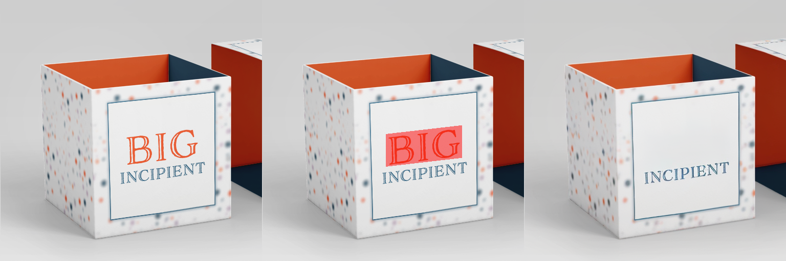
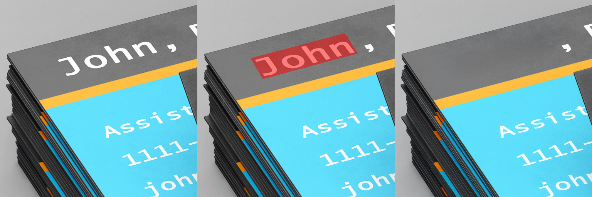

# OmniText: A Training-Free Generalist for Controllable Text-Image Manipulation

Official implementation of **OmniText** (ICLR 2026) - a single training-free
generalist for controllable text-image manipulation: removal, editing, style-based
editing, insertion, style-based insertion, repositioning, and rescaling.

- 📄 **Paper / OpenReview:** https://openreview.net/forum?id=zF7GyVXVw6
- 🗂️ **Benchmark (OmniText-Bench):** https://drive.google.com/file/d/16J8wyhpGcFnYwZLWa_01DLUOczIKgHVy/view

<p align="center">
  
  
  
</p>
<p align="center"><em>Text removal examples (input · target region · result).</em></p>

---

## News

- **[2026-06-13]** 🎉 Initial public release of the OmniText code and OmniText-Bench.

> This is the initial release. We will keep the repository updated — if you run into
> any issues, please [open an issue](../../issues); fixes and improvements will be
> posted here.

---

## Hardware requirements

| Application            | Min. GPU memory |
| ---------------------- | --------------- |
| Text removal           | 24 GB           |
| All other applications | 48 GB           |

---

## Installation

```bash
git clone <this-repo> omnitext && cd omnitext

# 1. Create the environment (Python 3.11)
conda create -n omnitext python=3.11 -y
conda activate omnitext

# 2. Install PyTorch for your CUDA version (example: CUDA 12.1+)
pip install torch==2.5.1 torchvision==0.20.1 torchaudio==2.5.1 \
    --index-url https://download.pytorch.org/whl/cu121

# 3. Install OmniText and its dependencies
pip install -r requirements.txt
pip install -e .
```

## Download model weights

This downloads the VAE, the TextDiffuser-2 inpainting checkpoint, and the
Stable Diffusion v1.5 tokenizer/scheduler into your Hugging Face cache, and
**automatically patches** the UNet config (`in_channels` 4 → 9) - no manual edits.

```bash
python scripts/download_weights.py
```

> Note: the original `runwayml/stable-diffusion-v1-5` repo was removed from the Hub
> in 2024; OmniText uses the maintained mirror
> `stable-diffusion-v1-5/stable-diffusion-v1-5` automatically.

## Download the benchmark (OmniText-Bench)

```bash
python scripts/download_data.py          # downloads + verifies ./OmniText-Bench
```

OmniText-Bench is released under a **custom license (attribution required;
redistribution of source files prohibited)** - see `OmniText-Bench/LICENSE.txt` and
`OmniText-Bench/TERMS.txt` after download. The dataset is intentionally **not**
bundled in this repository.

---

## Usage

Each application is a CLI script driven by a YAML config in [`configs/`](configs).
Common flags: `--config`, `--dataset-root`, `--output-dir`, `--gpu`, `--limit`.

> **Pipeline order:** editing, repositioning, and rescaling operate on the
> _text-removed_ image, so **run removal first** and pass its output directory via
> `--removal-output-dir`. Insertion uses the original input image.

```bash
# 1. Text removal (run this first)
python scripts/run_removal.py --config configs/removal.yaml \
    --dataset-root OmniText-Bench --output-dir experiments/removal

# 2. Text editing  (style-based: add --ref ref2)
python scripts/run_editing.py --config configs/editing.yaml \
    --dataset-root OmniText-Bench --removal-output-dir experiments/removal \
    --output-dir experiments/editing --ref ref1

# 3. Text insertion  (style-based: add --ref ref2)
python scripts/run_insertion.py --config configs/insertion.yaml \
    --dataset-root OmniText-Bench --output-dir experiments/insertion --ref ref1

# 4. Text repositioning
python scripts/run_repositioning.py --config configs/repositioning.yaml \
    --dataset-root OmniText-Bench --removal-output-dir experiments/removal \
    --output-dir experiments/repositioning

# 5. Text rescaling
python scripts/run_rescaling.py --config configs/rescaling.yaml \
    --dataset-root OmniText-Bench --removal-output-dir experiments/removal \
    --output-dir experiments/rescaling
```

Use `--limit N` to process only the first N images (handy for a quick check), and
`--gpu <index>` to select a device. See [`notebooks/demo.ipynb`](notebooks/demo.ipynb)
for a minimal end-to-end example.

| Application           | Script                        | Config               | Input image    |
| --------------------- | ----------------------------- | -------------------- | -------------- |
| Text removal          | `run_removal.py`              | `removal.yaml`       | original       |
| Text editing          | `run_editing.py --ref ref1`   | `editing.yaml`       | removal output |
| Style-based editing   | `run_editing.py --ref ref2`   | `editing.yaml`       | removal output |
| Text insertion        | `run_insertion.py --ref ref1` | `insertion.yaml`     | original       |
| Style-based insertion | `run_insertion.py --ref ref2` | `insertion.yaml`     | original       |
| Text repositioning    | `run_repositioning.py`        | `repositioning.yaml` | removal output |
| Text rescaling        | `run_rescaling.py`            | `rescaling.yaml`     | removal output |

---

## Repository structure

```
omnitext/
├── scripts/            # CLI entry points (download_* and run_*)
├── configs/            # YAML hyperparameter configs (one per application)
├── src/omnitext/       # importable library (models, pipelines, utils)
├── notebooks/
│   ├── demo.ipynb      # minimal end-to-end example
│   └── legacy/         # original, unmodified paper notebooks (provenance)
├── assets/             # example result images for this README
├── requirements.txt
└── pyproject.toml
```

The original notebooks that produced the paper results are preserved verbatim under
[`notebooks/legacy/`](notebooks/legacy) for provenance and reproducibility. The
`scripts/` are the maintained entry point.

---

## Citation

If you use OmniText or OmniText-Bench, please cite:

```bibtex
@inproceedings{
    gunawan2026omnitext,
    title={OmniText: A Training-Free Generalist for Controllable Text-Image Manipulation},
    author={Agus Gunawan and Samuel Teodoro and Yun Chen and Soo Ye Kim and Jihyong Oh and Munchurl Kim},
    booktitle={The Fourteenth International Conference on Learning Representations},
    year={2026},
    url={https://openreview.net/forum?id=zF7GyVXVw6}
}
```

## License

- **Code:** MIT - see [`LICENSE`](LICENSE).
- **OmniText-Bench dataset:** custom license (attribution required), distributed
  separately via the link above - see the license files inside the download.
